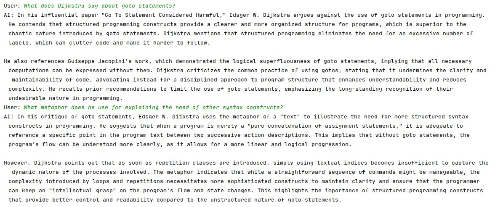

# ChatWithPDFs



Prototype app for question answering over a library of PDF files.

## Features

- It supports QA either for one PDF file or several PDF file in one directory.
- It uses `AllMiniLmL6V2EmbeddingModel` and `OpenAiChatModel`.

## Usage

```sh
program <API_KEY> <PATH>
```

Where:

- `API_KEY`: OpenAI API key/token.
- `PATH`: path to one PDF file or a folder containing several PDF files.